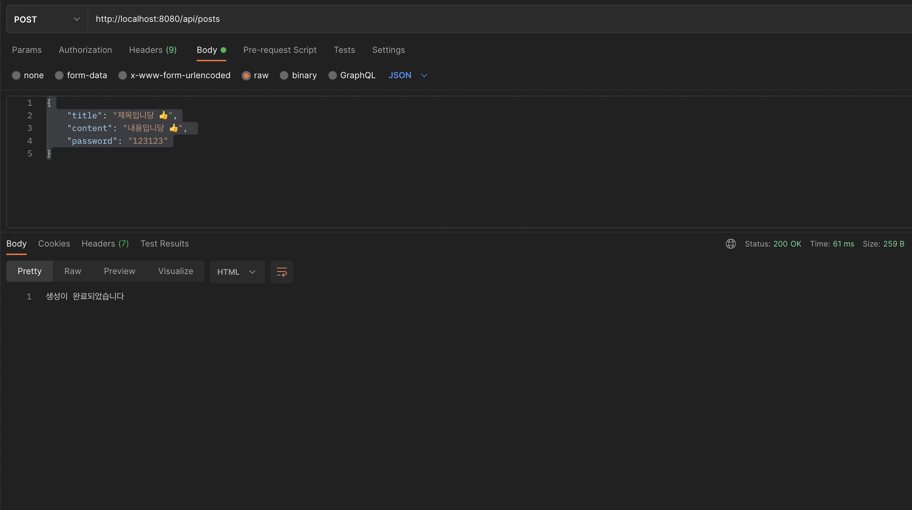
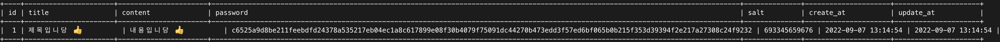
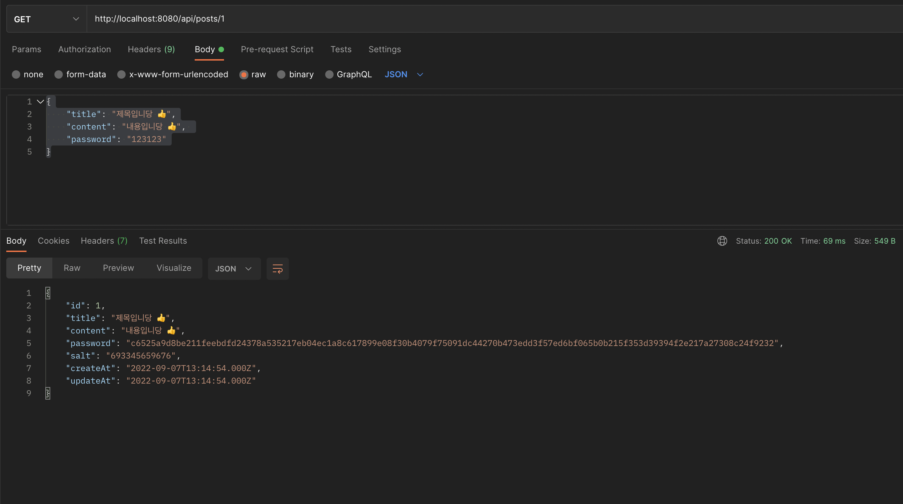
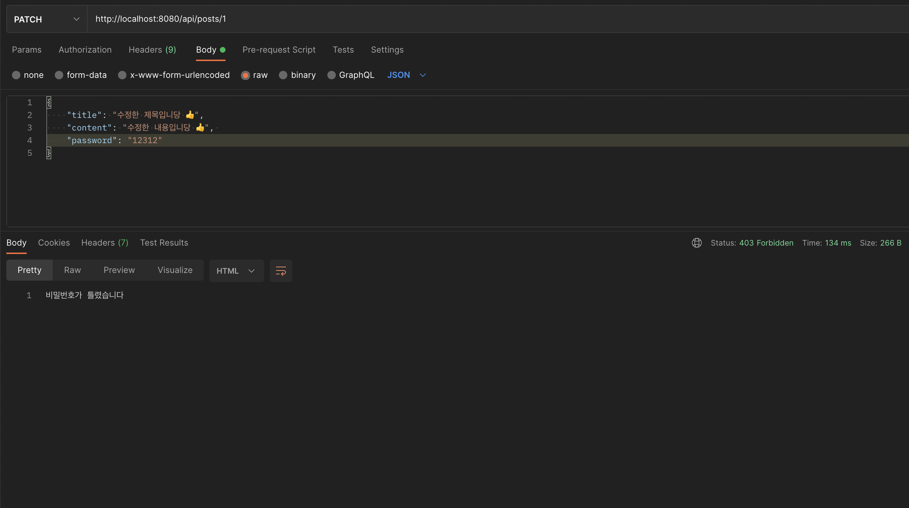
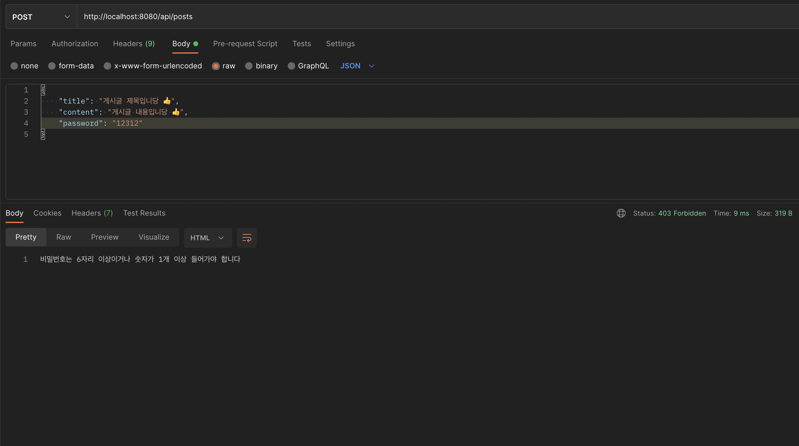
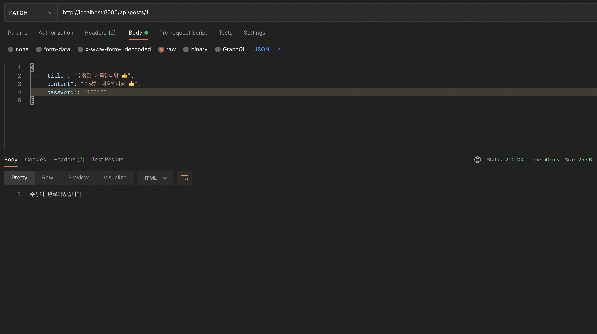
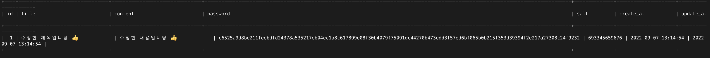
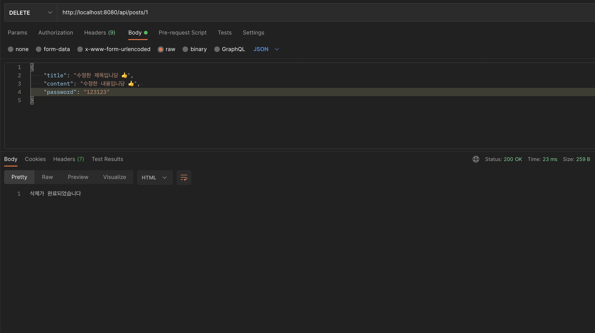
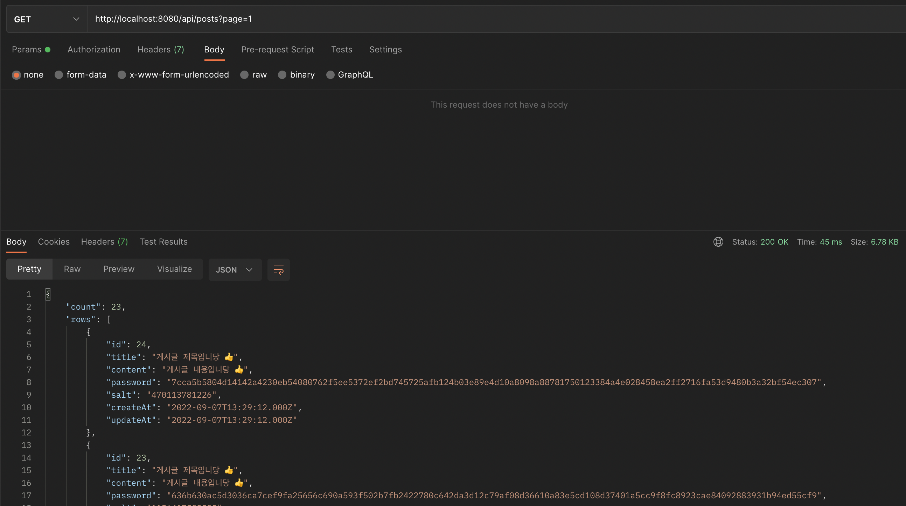

# 익명 게시판 API Project
#### 설명 
- 로그인/로그아웃 없이 누구나 쉽게 작성할 수 있는 게시판입니다.
- 게시판을 작성할 시, 해당 게시판에 Password를 설정하여 글쓴이만 수정 및 삭제 가능

#### 작업 기간
22.09.06 ~ 22.09.07

#### 기술 스택

`node.js` `expressJS` `MySQL` `SequelizeORM`

#### Git Flow

`main` : 작업한 develop 브랜치에서 PR받아서 최종 승인된 소스코드.  
`develop` : 작업하는 브랜치.

## ✅ 서비스 개요 & 구현 내용

#### 로그인 / 로그아웃 없이 제공하는 익명게시판

- 다음과 같이 `title`, `content`, `password`를 입력하고 게시글을 생성합니다.

- `req.params`를 통해 다음과 같이 단일 게시글을 조회합니다.

#### 비밀번호에 규칙을 생성하여 유효성 검사하기

- 비밀번호 규칙 : '최소 6자리 이상' 그리고 '최소 숫자 1개 이상' 
- 규칙에 위배되면 다음과 같이 메세지를 보냅니다.

#### 게시글에 Password를 부여하여 권한 관리

- `password`가 일치하지 않으면 게시글을 수정할 수 없습니다.

- `password`가 일치하면 게시글을 수정할 수 있습니다.

- `password`가 일치하면 게시글을 삭제할 수 있습니다.

#### Pagination을 활용하여 효율적으로 불러오기

- 게시글들을 `최신순`으로 나열했습니다.
- 20개씩 나누어 `페이지네이션` 으로 구성했습니다.
